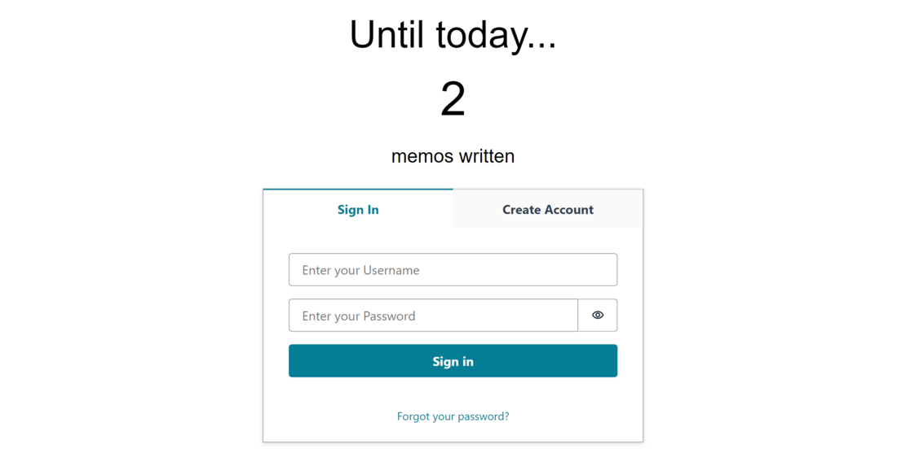
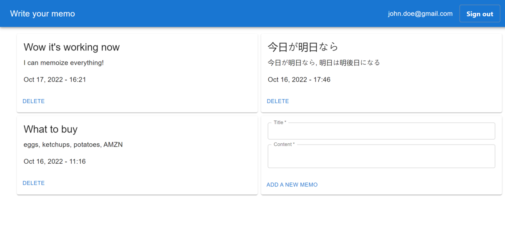

# Serverless Full Stack WebApp

This is a full stack webapp for starters who want to leverage the power of AWS serverless services!

Features include:

* Express API endpoint (both with and without authentication)
* React.js frontend (assets are delivered via CDN)
* E-mail authentication

## Overview
Here is the architecture of this kit. We use:

* [Amazon DynamoDB](https://aws.amazon.com/dynamodb/), a serverless scalable NoSQL database
* [Amazon API Gateway HTTP API](https://aws.amazon.com/api-gateway/) + [AWS Lambda](https://aws.amazon.com/lambda/) to build serverless API endpoint ([`serverless-express`](https://github.com/vendia/serverless-express))
* [Amazon CloudFront](https://aws.amazon.com/cloudfront/) + [S3](https://aws.amazon.com/s3/) to distribute frontend assets (React.js, Amplify libraries, MUI)
* [Amazon Cognito](https://aws.amazon.com/cognito/) for authentication. By default, you can sign in/up by email, but you can federate with other OIDC providers such as Google, Facebook, and more with a little modification.

Since it fully leverages AWS serverless services, you can use it with high cost efficiency, scalability, and almost no heavy lifting of managing servers! In terms of cost, we further discuss how much it costs in the below [#Cost](#cost) section.

### About the sample app
To show how this kit works, we include a sample web app to write and store your memos.
With this sample, you can easily understand how each component works with other ones, and what the overall experience will be like.

Here is a sign in/up page. Note that you can still get data from public API endpoints since it requires no authentication.
 

After a successful login, you can now freely add, delete, and view your own memos.

 

You can further improve this sample or remove all the specific code and write your own app. But first let's deploy this sample as-is!

## Add your own features
To implement your own features, you may want to add frontend pages or backend API endpoints. The frontend is an ordinary React.js application, so you can follow the conventional ways to add pages to it. As for backend, there are step-by-step guides to add features in [backend/README.md](backend/README.md), so please follow the guide.

If you want to add another authentication method such as Google or Facebook federation, you can follow this document: [Add social sign-in to a user pool](https://docs.aws.amazon.com/cognito/latest/developerguide/cognito-user-pools-configuring-federation-with-social-idp.html).

## Local development
To develop frontend or backend locally, please refer to each `README.md` in the subdirectories:

* [Frontend](./frontend/README.md)
* [Backend](./backend/README.md)

## Cost
API Gateway, Lambda, SQS, CloudFront, and S3 offer free tier plans, which allows you to use those services almost freely for small businesses.
Up to one million requests per month, most of the costs related to those services are free. See [this page for more details](https://aws.amazon.com/free/).

DynamoDB is billed basically by how many read and write counts processed. See [this page for the current prices](https://aws.amazon.com/dynamodb/pricing/on-demand/). DynamoDB provisioned capacity mode also offers free tier plans, so if you want to pay the minimal cost, you can switch the billing mode.

Other costs will be derived from data transfer and Elastic Container Repository (used for Docker Lambda). Although it usually does not cost much compared to other services, you may want to continuously monitor the billing metrics. Please refer to [the document to set CloudWatch alarm for AWS charges](https://docs.aws.amazon.com/AmazonCloudWatch/latest/monitoring/monitor_estimated_charges_with_cloudwatch.html).

## License
This library is licensed under the MIT-0 License. See the LICENSE file.
