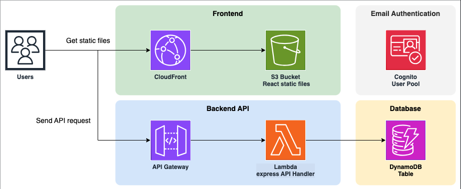

# Serverless Memo WebAPP

Features include:

- Express API endpoint (without authentication)
- React.js frontend (assets are delivered via CDN)
- E-mail authentication
- Instant deployment of the entire app

# Overview

Here is the architecture of this kit:

- [Amazon DynamoDB](https://aws.amazon.com/dynamodb/), a serverless scalable NoSQL database
- [Amazon API Gateway HTTP API](https://aws.amazon.com/api-gateway/) + [AWS Lambda](https://aws.amazon.com/lambda/) to build serverless API endpoint ([`serverless-express`](https://github.com/vendia/serverless-express))
- [Amazon CloudFront](https://aws.amazon.com/cloudfront/) + [S3](https://aws.amazon.com/s3/) to distribute frontend assets (React.js, Amplify libraries, MUI)
- [Amazon Cognito](https://aws.amazon.com/cognito/) for authentication. You sign in/up by email.



# Installation

Clone the repository to your local machine:

```bash
git clone https://github.com/312school/serverless-memo-23c-debian.git
cd your-serverless-app
```

BACKEND

Steps:
1. To initialize the backend of the application, please navigate to the backend directory within the project repository. This directory contains all the necessary code and configuration files for setting up the Lambda function.

2. Once you are in the backend folder, you will need to perform a two-step build process. 
    a. First, you must compile the TypeScript or JavaScript source code, which is achieved by running the build script. 
    b. Second, you must bundle the compiled code into a deployment package. This is done using the bundle script. Running npm run build compiles the source code into plain JavaScript, optimizing the code for a production environment. Following this, npm run bundle takes the compiled code and packages it into a dist folder. This folder will contain all the files necessary to deploy your Lambda function to AWS.
The commands to execute these steps are as follows:

```bash
npm install @types/node
npm run build
npm run bundle
```

* Please ensure that you have the latest version of npm and Node.js installed on your system to avoid any compatibility issues during the build process.

3. Upon successfully preparing your backend build with the dist folder, you are ready to proceed with the deployment of your serverless infrastructure, which includes setting up an API Gateway and Lambda function. The deployment can be performed using either the AWS Management Console for a manual setup or Terraform for an infrastructure-as-code approach.
    
    For lambda Function:
    - create Lambda function
    - upload the zipped code from the dist folder
    - specify the necessary attributes, such as function_name, handler, and runtime
    
    For API Gateway:
    - create API Gateway
    - create routes and integrate them with your Lambda function

4. To fully realize the serverless capabilities of your application, you will need to create a DynamoDB table and integrate it with your Lambda function:
    - provide a table name and specify the hash_key, define range_key, attributes, billing_mode
    - integrate table with lambda using environment variables

 * ensure your Lambda function has the right IAM role and permissions to access the DynamoDB table

5. To enhance our application with secure user authentication and management, we will integrate AWS Cognito. This service provides a robust solution for adding user sign-up, sign-in, and access control 
    - create a New User Pool
    - customize the User Pool according to your requirements. This may involve setting up attributes that define your users, configuring password policies, and customizing the user sign-up and sign-in experience
    - add an App Client
    - configure the App Client settings according to your application's needs, such as callback URLs for sign-in and sign-out, allowed OAuth flows, and scopes
    - integrate Cognito with Application


FRONTEND

For the deployment of the frontend aspect of our application, we utilize Amazon CloudFront in conjunction with Amazon S3. This combination allows us to deliver our content with low latency and high transfer speeds to provide an optimal user experience.

Steps:
1. To initialize the frontend of the application, please navigate to the frontend directory within the project repository.
2. For the efficient setup and compilation of the frontend portion of our application, it is imperative to correctly configure environment variables prior to the build process. The .env file contains environment-specific variables that are crucial for the configuration of your application's frontend. Ensure you modify the variables in this file to match the desired configurations for the current build. This may include API endpoints, region, or any other necessary settings.

3. With the environment variables set, the next step is to install Vite and trigger the build process.

```bash
# This command will download and install Vite locally in your project's node_modules directory
npm install vite

# This command will initiate Vite to compile the project assets, applying optimizations for production. Upon completion, the build files will be generated and stored in the designated dist directory or as specified in your Vite configuration.
npm run build
```
4. Upon successful creation of the necessary frontend build files, the subsequent phase involves deploying these assets to Amazon S3 and serving them through Amazon CloudFront.

* Confirm that the dist folder has been created and contains the updated build files.
    
    For S3 Bucket:
    - create a new S3 bucket
    - modify the bucket policy 
    - upload the contents of the dist folder to the S3 bucket ensuring that the upload maintains the directory structure, as it is crucial for the correct functioning of your web application

    For CloudFront:
    - create a new distribution, selecting the S3 bucket you have uploaded your files to as the origin
    - configure your distribution settings, including default root object, SSL/TLS certificate, and custom domain names if required

By following these detailed instructions, application will be successfully deployed 

# Contribution

If you are looking to add new features or integrate additional AWS services such as Amazon SQS (Simple Queue Service), Amazon CloudWatch, or other tools, we encourage you to contribute to our project.
Contribution Guidelines:
- Familiarize with the Project: Start by getting to know the existing application architecture, codebase, and our current use of AWS services. 
- Discuss New Features: If you have an idea for a new feature or an enhancement, please begin by opening an issue. It's an opportunity to validate your ideas and ensure alignment with the project's goals.
- Follow Best Practices: In implementing new features, ensure you adhere to the best practices for software development and AWS service integration. This includes writing clean, maintainable code and following the AWS Well-Architected Framework principles.
- Update Documentation: Alongside code changes, update the corresponding documentation to reflect the addition of new features or the integration of new AWS services.
- Submit a Pull Request: Once you have implemented the new feature or service integration, submit a pull request. Please provide a clear and detailed description of your changes, including the benefits and potential impact on the existing system.
- Code Review: Your pull request will be reviewed by the project maintainers. A review will focus on the quality of the code, the integration with existing features, and the overall benefit to the application.
- Testing: Ensure that your code includes tests that cover the new features and that all tests pass successfully. Comprehensive testing is essential to maintain the quality and reliability of the application.

By following these guidelines, you can contribute meaningfully and help expand the application's capabilities. Whether it's enhancing the message queuing with Amazon SQS, improving monitoring and logging with Amazon CloudWatch, or integrating other innovative AWS tools, your contributions are valuable to the project's growth and success.

# Resources

https://medium.com/tradeling/how-to-upload-files-on-amazon-s3-using-githubactions-ffe1243331ed
https://stackoverflow.com/questions/60854985/how-can-i-use-an-aws-http-api-not-rest-api-with-terraform
https://registry.terraform.io/providers/hashicorp/aws/latest/docs/resources/lambda_function